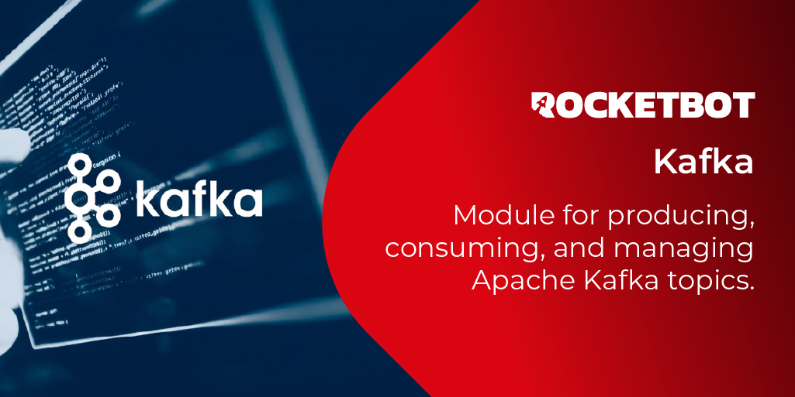

# Kafka

Módulo para produzir, consumir e administrar topics do Apache Kafka. Suporta autenticação SASL/SSL para Confluent Cloud, Azure Event Hubs, AWS MSK e clusters self-hosted.

*Read this in other languages: [English](Manual_Kafka.md), [Português](Manual_Kafka.pr.md), [Español](Manual_Kafka.es.md)*

## Como instalar este módulo

Para instalar o módulo no Rocketbot Studio, pode ser feito de duas formas:
1. Manual: __Baixe__ o arquivo .zip e descompacte-o na pasta módulos. O nome da pasta deve ser o mesmo do módulo e dentro dela devem ter os seguintes arquivos e pastas: \__init__.py, package.json, docs, example e libs. Se você tiver o aplicativo aberto, atualize seu navegador para poder usar o novo módulo.
2. Automático: Ao entrar no Rocketbot Studio na margem direita você encontrará a seção **Addons**, selecione **Install Mods**, procure o módulo desejado e aperte instalar.

## Como usar este modulo

Use este modulo para produzir, consumir e administrar topics do Apache Kafka a partir do Rocketbot. Suporta autenticacao SASL/SSL para Confluent Cloud, Azure Event Hubs, AWS MSK e clusters self-hosted.

Uso basico:
1. Execute Conectar ao Kafka com os bootstrap servers e, se necessario, o protocolo de seguranca e as credenciais SASL. Opcionalmente defina um identificador de Sessao para manter varias conexoes abertas ao mesmo tempo.
2. Execute Testar Conexao para confirmar que o Rocketbot consegue alcancar o cluster antes de montar o resto do fluxo.
3. Use os comandos de topics (Listar Topics, Criar Topic, Excluir Topic, Descrever Topic, Obter Offsets) para administra-los.
4. Use Produzir Mensagem / Produzir Batch para publicar, e Consumir Mensagens / Commit Offsets / Fechar Consumidor para ler.

Exemplos de conexao:
- Kafka local ou self-hosted sem autenticacao: Bootstrap servers `localhost:9092` ou `broker1:9092,broker2:9092`; Protocolo de seguranca 
`PLAINTEXT`; deixe vazios Mecanismo SASL, Usuario e Senha.
- Kafka self-hosted com SASL: Bootstrap servers `broker1:9093,broker2:9093`; Protocolo de seguranca `SASL_SSL` ou `SASL_PLAINTEXT` conforme o cluster; Mecanismo SASL `PLAIN`, `SCRAM-SHA-256` ou `SCRAM-SHA-512`; Usuario e Senha do usuario Kafka.
- Confluent Cloud: Bootstrap servers da configuracao do cluster, geralmente `pkc-xxxxx.region.provider.confluent.cloud:9092`; Protocolo de seguranca `SASL_SSL`; Mecanismo SASL `PLAIN`; Usuario = API key; Senha = API secret.
- Azure Event Hubs usando Kafka API: Bootstrap servers `<namespace>.servicebus.windows.net:9093`; Protocolo de seguranca `SASL_SSL`; Mecanismo SASL `PLAIN`; Usuario exatamente `$ConnectionString`; Senha = connection string completa do Event Hubs, por exemplo `Endpoint=sb://<namespace>.servicebus.windows.net/;SharedAccessKeyName=<policy>;SharedAccessKey=<key>`. Se a connection string incluir `EntityPath`, use o mesmo nome do Event Hub como topic Kafka.
- AWS MSK: Use a
 lista de brokers e o modo de autenticacao fornecidos pelo cluster. Para autenticacao IAM/OAUTHBEARER este modulo nao e suficiente como esta; use credenciais SCRAM ou PLAIN expostas pelo cluster.

Sessoes:
- Todos os comandos recebem um identificador de Sessao. Deixe vazio para usar a conexao padrao, ou defina um para manter varias conexoes/consumers independentes no mesmo fluxo (por exemplo, um por cluster ou por consumer group).
- Conectar ao Kafka apenas guarda a configuracao da conexao; ainda nao cria o consumer.

Publicar mensagens:
- Produzir Mensagem envia uma unica mensagem (chave opcional; o valor pode ser texto simples ou JSON).
- Produzir Batch envia uma lista JSON de mensagens em uma unica chamada, por exemplo `[{"key": "1", "value": "ola"}, {"key": "2", "value": {"total": 100}}]`. Cada item pode ser um valor simples ou um objeto `{key, value}`. Util quando o robo ja tem uma lista de registros para publicar juntos.

Consumir mensagens (fluxo de consumer group):
1. Execute 
Consumir Mensagens com Topicos (separados por virgula), Group ID e Offset inicial. Esses valores, junto com o Max poll interval, so se aplicam na primeira vez que o consumer e criado para essa sessao; para altera-los depois, execute primeiro Fechar Consumidor e chame Consumir Mensagens novamente.
2. Processe as mensagens retornadas no robo. Cada mensagem inclui seu proprio `topic`, `partition`, `offset`, `key` e `value`, assim voce identifica de qual topico ela veio ao assinar mais de um.
3. Execute Commit Offsets para informar ao Kafka que as mensagens foram processadas. Por padrao confirma todo o lote; se o robo processou apenas algumas, passe as bem-sucedidas em "Mensagens processadas" para confirmar somente ate essas (e as anteriores), deixando o restante para a proxima leitura tentar de novo.
4. Execute Fechar Consumidor ao terminar o fluxo, ou antes de alterar Topicos, Group ID, Offset inicial ou Max poll interval na mesma sessao.

Notas importantes:
- Testar Conexao nunca 
interrompe o fluxo: retorna true ou false para que o robo decida com base no resultado. Se falhar, o motivo e impresso no log de execucao, nao na variavel de resultado.
- Commit Offsets retorna false, sem lancar erro, quando nao havia nada novo para confirmar desde o ultimo commit -- isso e normal, nao uma falha. Se o commit em si falhar (por exemplo, o consumer foi removido do grupo), o comando lanca um erro em vez de retornar false.
- Os valores das mensagens sao armazenados e retornados exatamente como foram enviados, incluindo espacos, quebras de linha ou formatacao do texto original (Produzir Mensagem/Batch nao os recortam nem reformatam, e Consumir Mensagens os retorna sem alteracoes).
- Group ID, Offset inicial e Max poll interval se aplicam igualmente a todos os topicos de uma mesma chamada de Consumir Mensagens. Para usar configuracao diferente por topico, use uma sessao separada para cada um.
- Se Commit Offsets rodar mais tarde que o Max poll interval configurado desde o 
ultimo Consumir Mensagens, o Kafka pode ja ter removido o consumer do grupo; execute Consumir Mensagens novamente ou aumente o Max poll interval.
- Excluir Topic e irreversivel e, dependendo da configuracao do cluster, tambem apaga as mensagens do topico. Confira bem o nome antes de rodar isso em producao.
- Na primeira vez que o modulo roda em uma maquina, ele instala automaticamente a biblioteca `confluent-kafka` caso nao haja uma versao compativel ja incluida; isso requer acesso a internet nessa primeira execucao.

Referencias:
- https://kafka.apache.org/documentation/
- https://docs.confluent.io/platform/current/clients/confluent-kafka-python/html/index.html

## Descrição do comando

### Conectar ao Kafka

Configura a conexão com o cluster Kafka. Para Apache Kafka/self-hosted use broker:9092 com PLAINTEXT ou sua configuracao SSL/SASL. Para Confluent Cloud use SASL_SSL + PLAIN, usuario=API key e senha=API secret. Para Azure Event Hubs pelo endpoint Kafka use <namespace>.servicebus.windows.net:9093, SASL_SSL + PLAIN, usuario=$ConnectionString e senha=connection string completa do Event Hubs. Pode usar um identificador de sessao para alternar entre varias conexoes
|Parâmetros|Descrição|exemplo|
| --- | --- | --- |
|Bootstrap servers|Lista de brokers separados por virgula (hostporta). Exemplos localhost9092, pkc-xxxxx.region.provider.confluent.cloud9092, namespace.servicebus.windows.net9093 para Azure Event Hubs.|broker1:9092,broker2:9092|
|Protocolo de segurança|Protocolo de segurança da conexão, padrão PLAINTEXT||
|Mecanismo SASL|Mecanismo de autenticação SASL, necessário se o protocolo usar SASL||
|Usuário|Usuario SASL. No Confluent Cloud e a API key; no Azure Event Hubs com Kafka deve ser $ConnectionString.|usuário|
|Senha|Senha SASL. No Confluent Cloud e o API secret; no Azure Event Hubs e a connection string completa.|secr3t_p@ss|
|Sessão|Identificador de conexão, se vazio, a conexão padrão será usada|Conn1|
|Resultado|Variável onde o resultado da conexão é armazenado|conectado|

### Testar Conexão

Testa se o Rocketbot consegue se conectar ao Kafka com a configuração indicada, retornando true ou false; se falhar, o motivo é impresso no log de execução
|Parâmetros|Descrição|exemplo|
| --- | --- | --- |
|Sessão|Identificador da conexão configurada com 'Conectar ao Kafka'|Conn1|
|Timeout (segundos)|Tempo máximo de espera do teste|5|
|Resultado|Variável com true se a conexão foi bem-sucedida, ou false caso contrário|conexao_ok|

### Listar Topics

Lista os topics disponíveis no Kafka. Um topic é como um canal onde as mensagens são publicadas e lidas
|Parâmetros|Descrição|exemplo|
| --- | --- | --- |
|Sessão|Identificador de conexão|Conn1|
|Timeout (segundos)|Tempo máximo de espera da consulta|5|
|Resultado|Variável onde a lista de topics [{topic, partitions}] é armazenada|topics|

### Criar Topic

Cria um novo topic no Kafka, indicando nome, quantidade de partições e fator de replicação se aplicável
|Parâmetros|Descrição|exemplo|
| --- | --- | --- |
|Tópico|Nome do novo tópico|meu-topico|
|Partições|Quantidade de partições do tópico, padrão 1|1|
|Fator de replicação|Fator de replicação do tópico, padrão 1|1|
|Sessão|Identificador de conexão|Conn1|
|Resultado|Variável onde o resultado da criação é armazenado|resultado|

### Excluir Topic

IRREVERSÍVEL: exclui um topic do Kafka. Dependendo da configuração do cluster, também apaga as mensagens associadas. Confira bem o nome do tópico antes de rodar isso em produção
|Parâmetros|Descrição|exemplo|
| --- | --- | --- |
|Tópico|Nome exato do tópico a excluir. Esta ação não pode ser desfeita|meu-topico|
|Sessão|Identificador de conexão|Conn1|
|Resultado|Variável onde o resultado da exclusão é armazenado|resultado|

### Descrever Topic

Mostra informações detalhadas de um topic: partições, líder, réplicas, ISR, estado de erro e configuração. Serve para diagnóstico
|Parâmetros|Descrição|exemplo|
| --- | --- | --- |
|Tópico|Nome do tópico a descrever|meu-topico|
|Timeout (segundos)|Tempo máximo de espera da consulta, padrão 10|10|
|Sessão|Identificador de conexão|Conn1|
|Resultado|Variável com {topic, partitions [{partition, leader, replicas, isrs, error}], config {...}}|detalhe_topico|

### Obter Offsets

Consulta o offset mais antigo e o mais novo disponível de cada partição de um tópico. Serve para saber quantas mensagens estão disponíveis ou a partir de que ponto um consumer pode ler
|Parâmetros|Descrição|exemplo|
| --- | --- | --- |
|Tópico|Nome do tópico a consultar|meu-topico|
|Timeout (segundos)|Tempo máximo de espera da consulta, padrão 10|10|
|Sessão|Identificador de conexão|Conn1|
|Resultado|Variável com lista [{partition, earliest_offset, latest_offset, messages_available}]|offsets|

### Produzir Mensagem

Envia uma mensagem individual a um topic. Por exemplo, publicar um JSON com dados de uma fatura, pedido ou evento
|Parâmetros|Descrição|exemplo|
| --- | --- | --- |
|Tópico|Nome do tópico onde a mensagem será publicada|meu-topico|
|Chave|Chave da mensagem, determina a partição de destino|chave (opcional)|
|Mensagem|Conteúdo da mensagem a ser publicada (string ou JSON), enviado exatamente como digitado, incluindo quebras de linha|conteúdo da mensagem|
|Sessão|Identificador de conexão|Conn1|
|Resultado|Variável onde o resultado do envio é armazenado|resultado|

### Produzir Lote de Mensagens

Envia várias mensagens juntas a um topic. Útil quando o bot tem uma lista de registros e quer publicá-los todos no Kafka
|Parâmetros|Descrição|exemplo|
| --- | --- | --- |
|Tópico|Nome do tópico onde as mensagens serão publicadas|meu-topico|
|Mensagens (JSON)|Lista JSON de mensagens. Cada item pode ser {key, value} ou um valor simples|[{"key": "1", "value": "ola"}, {"key": "2", "value": {"total": 100}}]|
|Sessão|Identificador de conexão|Conn1|
|Resultado|Variável com {sent, failed} com a quantidade enviada e os erros|resultado|

### Consumir Mensagens

Lê mensagens de um ou vários topics, cada uma com seu próprio campo 'topic'. Tem limite de quantidade e de tempo. O consumer (topics, group ID, offset inicial, max poll interval) é criado na primeira chamada da sessão e reutilizado depois; execute 'Fechar Consumidor' primeiro para alterar esses valores
|Parâmetros|Descrição|exemplo|
| --- | --- | --- |
|Tópicos|Tópicos a consumir, separados por vírgula. Se informar mais de um, cada mensagem pode vir de qualquer um deles; o campo 'topic' indica de qual|topico1,topico2|
|Group ID|Identificador do consumer group, compartilhado por todos os tópicos em 'Tópicos'. Só se aplica na criação do consumer|meu-grupo|
|Offset inicial|De onde começar a ler se não houver offset salvo. Só se aplica na criação do consumer||
|Timeout (segundos)|Tempo máximo de espera por mensagem antes de continuar|5|
|Máximo de mensagens|Quantidade máxima de mensagens a buscar nesta execução|10|
|Max poll interval (segundos)|Tempo máximo entre chamadas a 'Consumir Mensagens' ou 'Commit Offsets' antes que o Kafka remova o consumer por inatividade. Padrão 1800 (30 min). Só se aplica na criação do consumer|1800|
|Sessão|Identificador de conexão|Conn1|
|Resultado|Variável onde a lista de mensagens recebidas é armazenada. Cada mensagem inclui topic, partition, offset, key e value, assim é possível identificar de qual tópico ela veio ao consumir vários de uma vez|mensagens|

### Commit Offsets

Confirma que as mensagens consumidas foram processadas e indica ao Kafka de onde continuar a próxima leitura. Por padrão confirma todo o lote de 'Consumir Mensagens'; use 'Mensagens processadas' para confirmar somente até a última bem-sucedida
|Parâmetros|Descrição|exemplo|
| --- | --- | --- |
|Sessão|Identificador de conexão|Conn1|
|Mensagens processadas (opcional)|Opcional. Lista JSON com as mensagens que o bot processou com sucesso (mesmo formato retornado por 'Consumir Mensagens'). Se deixado vazio, confirma todo o lote lido|[{"topic": "facturas", "partition": 0, "offset": 41}]|
|Resultado|Variável com true se confirmado, ou false se não havia nada novo para confirmar|resultado|

### Fechar Consumidor

Fecha a sessão do consumidor e libera seus recursos. É necessário antes de alterar a configuração do consumer (Group ID, Offset inicial, Max poll interval) na próxima chamada de 'Consumir Mensagens'
|Parâmetros|Descrição|exemplo|
| --- | --- | --- |
|Sessão|Identificador de conexão|Conn1|
